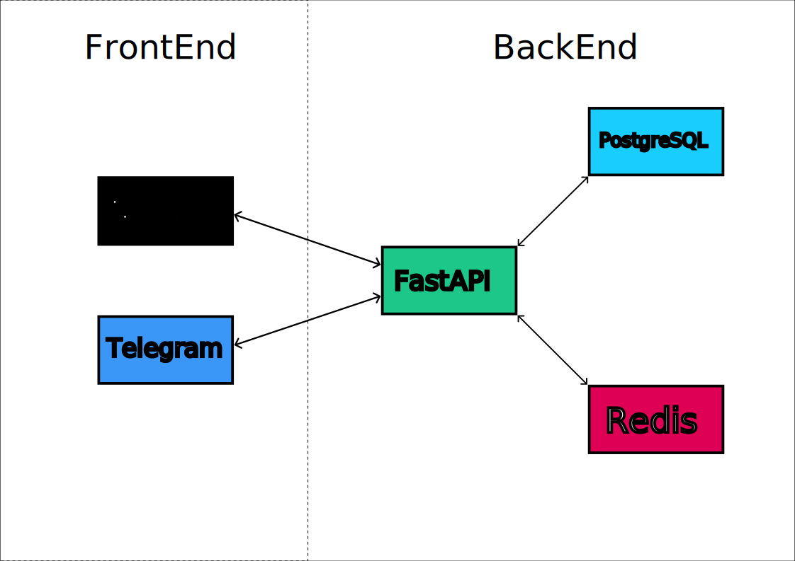

# Telegram Bot / Web UI with PostgreSQL and Async SQLAlchemy (alembic)

## System Architecture

## Feature Overview

| Component         | Technology  | Purpose                                                    |
| ----------------- | ----------- | ---------------------------------------------------------- |
| **Bot Framework** | Aiogram     | Asynchronous Telegram Bot API implementation               |
| **Database**      | PostgreSQL  | Relational data storage with ACID compliance               |
| **ORM**           | SQLAlchemy  | Async database operations and modeling                     |
| **Migrations**    | Alembic     | Database schema version control and migration management   |
| **Scheduling**    | APScheduler | Background task execution (reminders, notifications)       |
| **Caching**       | Redis       | High-performance in-memory data caching                    |
| **Configuration** | Pydantic    | Type-safe settings management with .env support            |
| **Logging**       | Loguru      | Structured logging with rich formatting and file rotation  |
| **Web Interface** | Next.js     | Modern React framework for admin panel and user dashboards |

## Setup Commands

| Command      | Action                            |
| ------------ | --------------------------------- |
| `make dev`   | Start development environment     |
| `make prod`  | Start production deployment       |
| `make stop`  | Stop all containers               |
| `make clean` | Remove all containers and volumes |
